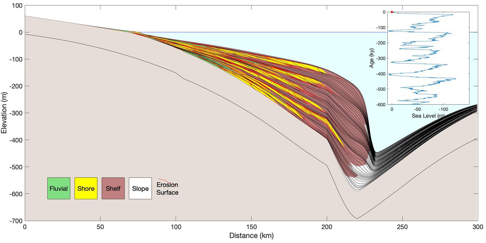

.. image:: _static/sequence-logo-text-lowercase.png
    :align: center
    :scale: 100%
    :alt: Sequence
    :target: https://sequence.readthedocs.org/

Sequence is a modular 2D (i.e., profile) sequence stratigraphic model
that is written in Python and implemented within the Landlab framework.
Sequence represents time-averaged fluvial and marine sediment transport
via differential equations. The modular code includes components to deal
with sea level changes, sediment compaction, local or flexural isostasy,
and tectonic subsidence and uplift.

Getting Started
---------------

.. toctree::
   :maxdepth: 3

   readme

..   usage
..   installation

API Reference
-------------

If you are looking for information on a specific function, class, or
method, this part of the documentation is for you.

.. toctree::
   :maxdepth: 2

   api/index

Miscellaneous Pages
-------------------

.. toctree::
   :maxdepth: 2

   authors
   changelog
   contributing
   license

Indices and tables
==================
* :ref:`genindex`
* :ref:`modindex`
* :ref:`search`
